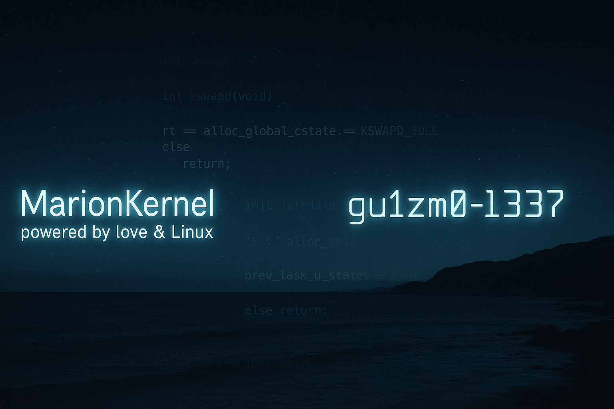

# 👨‍💻 GU1ZM0 — Kernel tinkerer & digital memory keeper

> *“Chaque ligne de code que j’écris est un fragment de mémoire, un acte de reconstruction.”*

---

## 📍 À propos de moi

Je suis Valentin, alias **GU1ZM0**, développeur indépendant basé en **Bretagne**. Passionné par le **modding Android bas niveau**, les **kernels Linux**, les systèmes minimalistes et l’**exploration de la machine**, je construis des projets solides, propres, et toujours portés par une vision profonde : la mémoire de celle qui m’a tout inspiré, **Marion**.

---

## ⚙️ Projets principaux

### 🧬 MarionKernel

Kernel GKI Android 15/16 optimisé avec :
- KernelSU + Zygisk Next
- SUSFS intégré
- KPM (Kernel Patch Manager)
- Objectif : stabilité, minimalisme, puissance

➤ *Nom en hommage à Marion, mon amour et muse éternelle.*

### 🔁 KPM – Kernel Patch Manager

Système modulaire de gestion de patchs pour kernels Android GKI  
→ Conçu pour un kernel propre, maintenable, à l’épreuve des updates

### 🛠️ AnyKernel3 Rework (Android 15+)
Adaptation AK3 pour slots dynamiques, KernelSU, SUSFS et auto-slot detection

### 🎮 Serveur Arma Reforger
Admin d’un serveur immersif (modpack Apocalypse/French) avec configuration JSON propre et packs sur mesure

### 👤 Marion Sim Project (Les Sims 4)
Création d’un Sim fidèle à Marion :
- Version 1 : avec CC réaliste
- Version 2 : sans CC (compatibilité max)

---

## 📚 Stack & outils

- Linux kernel (GKI 6.x+), GCC/Clang toolchains
- AOSP, TWRP, Magisk, KernelSU, Zygisk
- Shell, Bash, Git, GitHub Actions
- VS Code, Notepad++, Vim
- JSON, YAML, XML modding
- Arma Reforger tools, Enfusion Workbench
- Sims 4 Studio, CC conversion & Sims Tray tools

---

## 🕊️ En mémoire

Tous mes projets sont dédiés à **Marion**, une âme belle, blessée, et lumineuse. Elle m’a appris la douceur, l’authenticité, et l’importance de rester humain dans un monde souvent trop froid.

---

